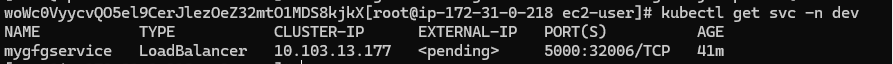
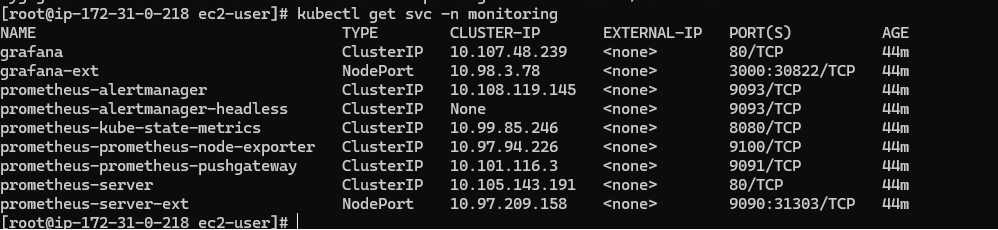
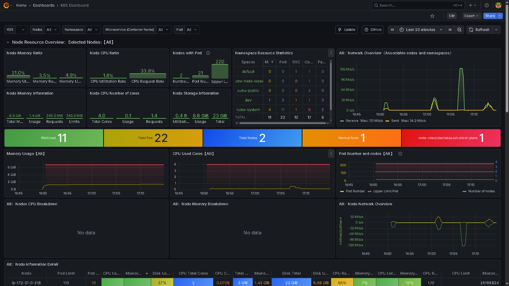

# Advanced End-to-End DevOps Project
 
An end-to-end CI/CD pipeline that takes a web application from a Git push to a fully monitored production deployment on Kubernetes. The pipeline integrates **Git, Docker, Kubernetes, Helm, GitHub Actions, Jenkins, Terraform, Ansible, Prometheus, Grafana, and AWS**, with infrastructure provisioned automatically and promotion across `dev → qa → prod` namespaces.
 
---
 
## Table of Contents
 
- [Architecture](#architecture)
- [Application](#application)
- [Tech Stack](#tech-stack)
- [Prerequisites](#prerequisites)
- [Setup Guide](#setup-guide)
  - [1. Fork and Customize the Repository](#1-fork-and-customize-the-repository)
  - [2. Set Up the Jenkins Master Server](#2-set-up-the-jenkins-master-server)
  - [3. Configure the Jenkins Worker Node](#3-configure-the-jenkins-worker-node)
  - [4. Create the Jenkins Pipeline](#4-create-the-jenkins-pipeline)
  - [5. Configure the GitHub Webhook](#5-configure-the-github-webhook)
  - [6. Configure DockerHub Credentials](#6-configure-dockerhub-credentials)
  - [7. Configure AWS Credentials](#7-configure-aws-credentials)
  - [8. Run the Pipeline](#8-run-the-pipeline)
  - [9. Make Changes and Test the Workflow](#9-make-changes-and-test-the-workflow)
- [Pipeline Stages](#pipeline-stages)
- [Accessing the Deployed Application](#accessing-the-deployed-application)
- [Monitoring with Prometheus and Grafana](#monitoring-with-prometheus-and-grafana)
- [Contact](#contact)
---
 
## Architecture
 

 
The pipeline provisions a multi-node Kubernetes cluster on AWS via Terraform and Ansible, builds and tests the application through GitHub Actions, and uses Jenkins to orchestrate infrastructure creation, deployment, and promotion across environments. Prometheus and Grafana provide cluster-wide observability.
 
## Application
 
The pipeline deploys a Snake Game web application to the provisioned Kubernetes cluster.
 

 
## Tech Stack
 
| Category            | Tools                                  |
|---------------------|-----------------------------------------|
| Version Control      | Git, GitHub                            |
| CI                   | GitHub Actions                         |
| CD / Orchestration   | Jenkins                                |
| Containerization     | Docker                                 |
| Container Orchestration | Kubernetes, Helm                    |
| Infrastructure as Code | Terraform, Ansible                   |
| Cloud Provider       | AWS (EC2, IAM, VPC, Security Groups)   |
| Monitoring           | Prometheus, Grafana                    |
| Scripting            | Shell                                  |
 
## Prerequisites
 
Before starting, ensure you have:
 
- An AWS account with permissions to create EC2 instances, VPCs, security groups, and IAM users
- A DockerHub account
- A GitHub account with a fork of this repository
- An SSH key pair for accessing EC2 instances
- Basic familiarity with Jenkins, Terraform, and Kubernetes
---
 
## Setup Guide
 
### 1. Fork and Customize the Repository
 
Fork this repository to your own GitHub account and make any project-specific customizations before proceeding.
 
### 2. Set Up the Jenkins Master Server
 
1. Launch an AWS EC2 instance and configure its security group to allow inbound traffic on ports **8080** and **50000**.
2. Install Docker and Git on the instance.
3. Run Jenkins as a Docker container:
```bash
   docker run -d \
     -v jenkins_home:/var/jenkins_home \
     -p 8080:8080 -p 50000:50000 \
     --restart=on-failure \
     jenkins/jenkins:lts-jdk21
```
 
4. Access Jenkins at `http://<instance_public_ip>:8080`, complete the setup wizard, and install the suggested plugins.
### 3. Configure the Jenkins Worker Node
 
Launch a second EC2 instance and configure it as a Jenkins worker (agent) node by following the steps in [`JenkinsSlaveEc2Node`](./JenkinsSlaveEC2Node).
 
### 4. Create the Jenkins Pipeline
 
In the Jenkins dashboard, create a new pipeline named **`mypipeline`**, point it to this repository, and enable the GitHub webhook trigger.
 
### 5. Configure the GitHub Webhook
 
In your forked repository's settings, add a webhook:
 
- **Payload URL:** `http://<instance_public_ip>:8080/github-webhook/`
- **Event:** Just the push event
### 6. Configure DockerHub Credentials
 
GitHub Actions handles building, testing, and publishing the Docker image, so DockerHub credentials must be added as GitHub Actions secrets:
 
| Secret Name      | Description            |
|-------------------|-------------------------|
| `DockerUsername`  | Your DockerHub username |
| `DockerPassword`  | Your DockerHub password/token |
 
### 7. Configure AWS Credentials
 
Terraform requires AWS credentials on the Jenkins worker node. Choose one of the following approaches:
 
**Option A — Configure directly on the worker node:**
 
```bash
aws configure
```
 
Provide the access key and secret key from an IAM user that has permissions for EC2, VPC, and security group creation (create the IAM user first if it doesn't exist).
 
**Option B — Store in Jenkins credentials:**
 
Add the AWS access key and secret key as Jenkins credentials, then reference them in a configuration step within the `Jenkinsfile` so Terraform can use them automatically.
 
### 8. Run the Pipeline
 
Trigger the `mypipeline` build in Jenkins, providing any required parameters, and confirm that all stages complete successfully.
 
### 9. Make Changes and Test the Workflow
 
1. Make code changes locally, updating the SSH key pair and the Docker image tag in `./build/Jenkinsfile` as needed.
2. Push the changes and open a pull request.
3. GitHub Actions will automatically build, test, and push the Docker image.
4. Merging the pull request triggers the Jenkins pipeline, which deploys the updated application to the Kubernetes cluster.
---
 
## Pipeline Stages
 
The Jenkins pipeline executes the following stages in order:
 
1. **Git** — Checkout source code
2. **Setup Ansible** — Prepare configuration management tooling
3. **Setup Terraform** — Prepare infrastructure provisioning tooling
4. **Create Infrastructure for PROD** — Provision AWS resources via Terraform
5. **Configure Multi-Node K8s Cluster** — Set up the Kubernetes cluster on the provisioned infrastructure
6. **Configure Monitoring Tool** — Deploy Prometheus and Grafana
7. **Deploy the Webserver** — Deploy the application
8. **Promote to QA** — Promote the build to the QA namespace
9. **Promote to PROD** — Promote the build to the PROD namespace

 
---
 
## Accessing the Deployed Application
 
1. From the Kubernetes master node terminal, retrieve the service's NodePort:
```bash
   sudo kubectl get svc -n dev
```
 
   
 
2. Visit the application in your browser:
```
   http://<k8s-master-node-ip>:<NodePort>
```
 
   > Example: NodePort `32006`
 
The application is deployed independently into each environment namespace — `dev`, `qa`, and `prod` — so the same steps apply across environments by switching the `-n` flag.
 
---
 
## Monitoring with Prometheus and Grafana
 
1. Get the NodePorts for Prometheus and Grafana:
```bash
   sudo kubectl get svc -n monitoring
```
 
   
 
2. Access the dashboards:
   | Service     | URL                                              |
   |--------------|---------------------------------------------------|
   | Prometheus   | `http://<k8s-master-ip>:<prometheusPort>` (e.g. `31303`) |
   | Grafana      | `http://<k8s-master-ip>:<grafanaPort>` (e.g. `30822`)    |
3. Log in to Grafana:
   - **Username:** `admin`
   - **Password:** Retrieve it from the cluster:
```bash
     kubectl get secret grafana -n monitoring -o jsonpath='{.data.admin-password}' | base64 --decode
```
 
4. Add Prometheus as a data source in Grafana.
5. Import a pre-built dashboard from the [Grafana Dashboard Library](https://grafana.com/grafana/dashboards/) using its dashboard ID, rather than building one from scratch.
Once configured, you'll have full visibility into your Kubernetes cluster's health and performance.
 

 
---
 
## Contact
 
Questions or running into issues? Feel free to connect on [LinkedIn](https://www.linkedin.com/in/vikas-kanturi-224108387/).

 
