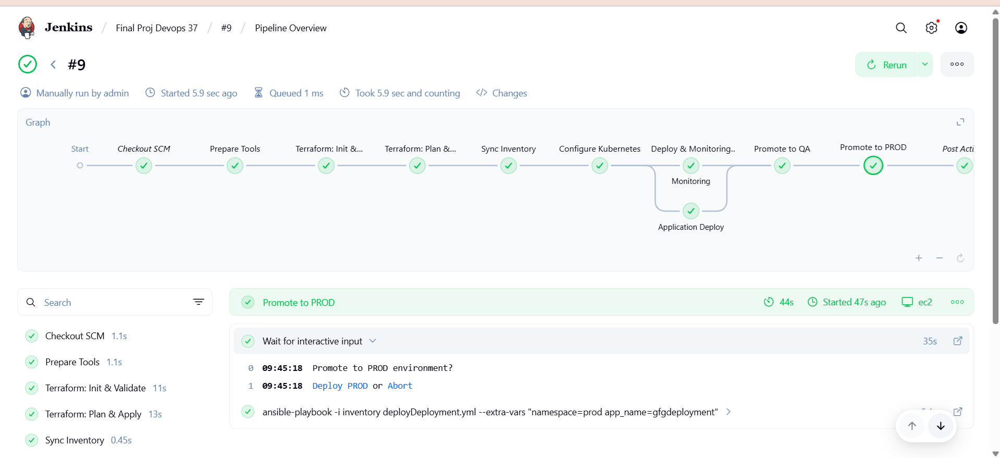

# Advanced End-to-End DevOps Project 

This repository contains an advanced end-to-end DevOps project that integrates various tools such as Git, Docker, Kubernetes, Helm, GitHub Actions, Jenkins, Terraform, Ansible, Prometheus, Grafana, AWS, and Shell scripts. The project sets up a continuous integration and deployment pipeline.

## Architecture Diagram


## WebApp Overview

- We are going to deploy below game app on the K8s cluster.


My recorded session for this project is uploaded on GeeksForGeeks - https://www.geeksforgeeks.org/batch/devops-22?tab=Live

## Project Overview

### Step 1: Fork and Customize Repository

- Fork this repository and make any customizations if needed.

### Step 2: Set Up Jenkins Server on AWS EC2 Instance

- Create an EC2 instance on AWS with security group rules allowing ports 8080 and 50000.
- Install Docker on the instance.
- Configure Jenkins using the following command:
  ```bash
  docker run -d -v jenkins_home:/var/jenkins_home -p 8080:8080 -p 50000:50000 --restart=on-failure jenkins/jenkins:lts-jdk21
- Access Jenkins at http://<your-instance-ip>:8080, configure Jenkins, and install suggested plugins.

### Step 3: Configure Jenkins Worker Node
- Launch a second EC2 instance and configure it as a Jenkins worker node using the steps in the `JenkinsSlaveEc2Node` file.

### Step 4: Create Jenkins Pipeline
- Create a pipeline in Jenkins named "mypipeline" with the repository location and enable the webhook.

### Step 5 Configure GitHub Webhook 
- Add a webhook to your GitHub repository with the Jenkins URL: http://<your-jenkins-ip>:8080/github-webhook/.
- Select only the push event.

### Step 6 Configure DockerHub Credentials 
- As we are using GitHub Workflows for the Build, Testing, and publishing of my docker image, Hence we need to add DockerHub credentials to GitHub secrets with variables` DockerUsername` and `DockerPassword`.

### Step 7 Configure AWS Credentials
- Provide AWS credentials on the Jenkins slave node using _#awS configure_ or store them in Jenkins secrets, and then further add a step in `Jenkinsfile` to configure AWS credentials automatically. Terraform will use these credentials.

### Step 8 Run the Pipeline
- Trigger the pipeline in Jenkins With Parameters and ensure all steps are executed correctly.

### Step 9 Make Changes and Test
- Make changes in your code locally, push to GitHub, and create a pull request.
- GitHub Actions will build, test, and push the Docker image.
- Merge the pull request to trigger the Jenkins pipeline, Which will deploy your app on top of k8s cluster

### Step 10: Jenkins Pipeline Stages
- Git
- Setup Ansible
- Setup Terraform
- Create Infrastructure for PROD
- Configure multi node k8s cluster on the created infrastructure
- Configure Monitoring Tool
- Deploy the Webserver
- Promote to QA
- Promote to PROD
- 

### Step 11: Access the Deployed Webserver
- Visit http://<your-K8sNode-ip>:NodePort to see the deployed webserver.
- Webserver will be deployed in respective namespace, like dev, qa, prod


### Step 12 Create Grafana Dashboard: 
- Got to Grafana server - http://<your-Prodserver-ip>:3000
- Add the Prometheus datasource to grafana
- Visit [View Pre-Created Grafan Dashbords](https://grafana.com/grafana/dashboards/) to select a pre-created dashboard for monitoring the k8s server, you can copy that dashboard ID, and instead of creating the dashboard from scratch we can import a pre-created dashboard.
- Now you are good to go! Visualize your complete k8s cluster Now!

- 

Connect with me on LinkedIn in any kind of challenges - [Linkedin](https://www.linkedin.com/in/sudhanshu--pandey/)
